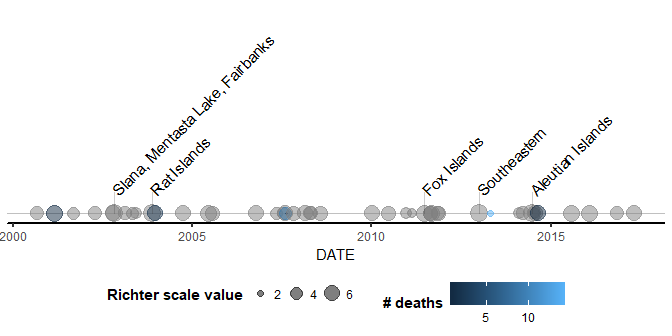
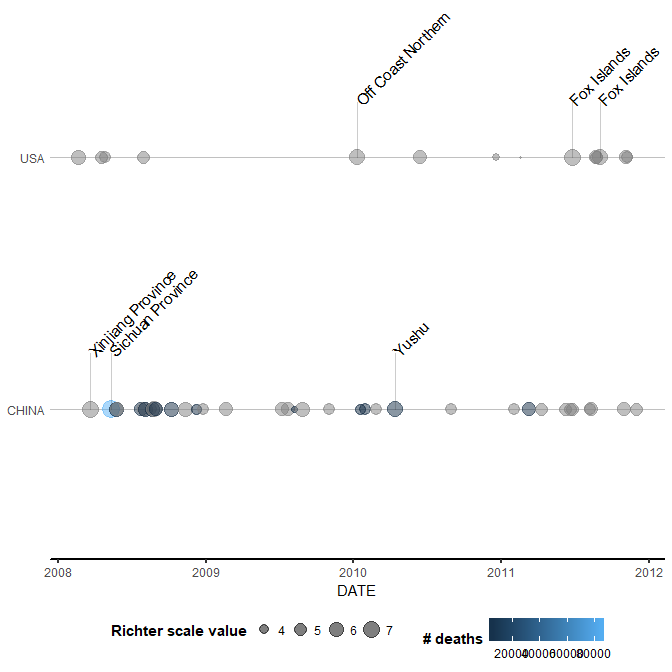

<!-- README.md is generated from README.Rmd. Please edit that file -->
Earthquakes4Coursera
====================

Earthquakes4Coursera has been developed in a context of the Coursera's course "Mastering Software Development in R Capstone". The goal of the package is to visualize earthquakes registered in [NOAA Significant Earthquake Database](https://www.ngdc.noaa.gov/nndc/struts/form?t=101650&s=1&d=1).

Installation
------------

You can install Earthquakes4Coursera from github with:

``` r
# install.packages("devtools")
devtools::install_github("Valentin-Konoshenko/Earthquakes4Coursera")
```

Usage
-----

It allows to visualize earthquakes in two ways:

-   Time lines to show earthquakes in time and
-   Mapping to visualize earthquakes in space

Examples of timelines
---------------------

This is a basic example of plotting a timeline:

``` r
library(Earthquakes4Coursera)
library(dplyr)
library(ggplot2)
#> Warning: package 'ggplot2' was built under R version 3.4.4
NOAAC <- file_read() %>% eq_clean_data()
NOAAC %>%
  dplyr::filter(COUNTRY %in% c("USA"),
                between(lubridate::year(DATE), 2000, 2017)) %>%
  ggplot(aes(x = DATE,
             color = DEATHS,
             size = EQ_PRIMARY)) +
  geom_timeline() +
  theme_timeline() +
  labs(size = "Richter scale value", colour = "# deaths") +
  geom_timeline_label(aes(label = LOCATION_NAME), n_max = 5)
```



The following timeline stratifies the earthquakes by countries:

``` r
NOAAC %>%
  dplyr::filter(COUNTRY %in% c("USA", "CHINA"),
                between(lubridate::year(DATE),  2008, 2011)) %>%
  ggplot(aes(x = DATE,
             y = COUNTRY,
             color = DEATHS,
             size = EQ_PRIMARY
  )) +
  geom_timeline() +
  theme_timeline() +
  labs(size = "Richter scale value", color = "# deaths") +
  geom_timeline_label(aes(label = LOCATION_NAME), n_max = 3)
```



Example of mapping
------------------

``` r
library(lubridate)
NOAAC %>%
  dplyr::filter(COUNTRY == "MEXICO" & lubridate::year(DATE) >= 2014) %>%
  dplyr::mutate(popup_text = eq_create_label(.)) %>%
  eq_map(annot_col = "popup_text")
```

<!--html_preserve-->

<script type="application/json" data-for="htmlwidget-25406175c6828b41531d">{"x":{"options":{"crs":{"crsClass":"L.CRS.EPSG3857","code":null,"proj4def":null,"projectedBounds":null,"options":{}}},"calls":[{"method":"addTiles","args":["//{s}.tile.openstreetmap.org/{z}/{x}/{y}.png",null,null,{"minZoom":0,"maxZoom":18,"tileSize":256,"subdomains":"abc","errorTileUrl":"","tms":false,"noWrap":false,"zoomOffset":0,"zoomReverse":false,"opacity":1,"zIndex":1,"detectRetina":false,"attribution":"&copy; <a href=\"http://openstreetmap.org\">OpenStreetMap<\/a> contributors, <a href=\"http://creativecommons.org/licenses/by-sa/2.0/\">CC-BY-SA<\/a>"}]},{"method":"addCircleMarkers","args":[[17.397,17.235,14.728,17.682,15.022,18.584,16.737,16.646],[-100.972,-100.746,-92.578,-95.653,-93.899,-98.399,-94.946,-97.653],[7.2,6.4,6.9,6.3,8.2,7.1,6.1,7.2],null,null,{"interactive":true,"className":"","stroke":true,"color":"#03F","weight":1,"opacity":0.5,"fill":true,"fillColor":"#03F","fillOpacity":0.2},null,null,["<b>Location:<\/b> Guerrero; Mexico City <br/><b>Magnitude:<\/b> 7.2 <br/>","<b>Location:<\/b> Tecpan <br/><b>Magnitude:<\/b> 6.4 <br/>","<b>Location:<\/b> San Marcos <br/><b>Magnitude:<\/b> 6.9 <br/><b>Total deaths:<\/b>        3 <br/>","<b>Location:<\/b> Oaxaca <br/><b>Magnitude:<\/b> 6.3 <br/><b>Total deaths:<\/b>        1 <br/>","<b>Location:<\/b> Oaxaca, Chiapas, Tabasco; Guatemala <br/><b>Magnitude:<\/b> 8.2 <br/><b>Total deaths:<\/b>       98 <br/>","<b>Location:<\/b> Mexico City, Morelos, Puebla <br/><b>Magnitude:<\/b> 7.1 <br/><b>Total deaths:<\/b>      369 <br/>","<b>Location:<\/b> Oaxaca <br/><b>Magnitude:<\/b> 6.1 <br/><b>Total deaths:<\/b>        5 <br/>","<b>Location:<\/b> Oaxaca <br/><b>Magnitude:<\/b> 7.2 <br/><b>Total deaths:<\/b>       13 <br/>"],null,null,{"interactive":false,"permanent":false,"direction":"auto","opacity":1,"offset":[0,0],"textsize":"10px","textOnly":false,"className":"","sticky":true},null]}],"limits":{"lat":[14.728,18.584],"lng":[-100.972,-92.578]}},"evals":[],"jsHooks":[]}</script>
<!--/html_preserve-->
